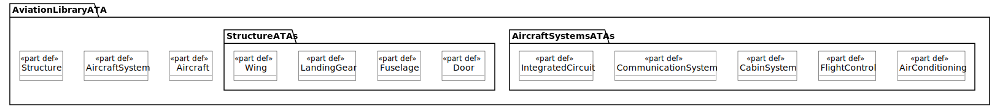

# Low-Fidelity A350 Example

## Overview

This example consists of the following files:

- `DemoDASC.svg`: a visual rendering of the model, a (very low-fidelity) A350 airliner.
- `DemoDASC.sysml`: the actual model.
- `Library.svg`: a visual rendering of the _AviationLibraryATA_.
- `model.json`: the JSON representation of the model when fetched from a SysML-v2 API compliant model server.
- `queries`: a couple of example SQL queries for that given model.
  - `GetAvionicsElements.sql`: Collects all instantiations of the definitions in the selected ATA package `AircraftSystemsATAs`.
  - `GetStructureElements.sql`: Collects all instantiations of the definitions in the selected ATA package `StructureATAs`.
  - `SelectParts.sql`: Find all part instances and their definitions (as in their types).
  - `SelectPartsExceptLibrary.sql`: Find part instances and definitions that are not instantiated by the _AviationLibraryATA_.
- `README.md`: this file.

The model contains a low-fidelity (only a handful of systems) model of an A350. This is the entire model:


And this is the mockup of an ATA chapter oriented aviation library:



## Workflow

The following steps are:

1. Initialize a database with the respective schema.
2. Import a model into the database;
   a. from either a file, **or**
   b. from an SysML-v2 API compliant model server.
3. Query the model.

To use our the `sysml-v2-sql` tool, the following steps are required:

```sh
# Step 1.
sysml-v2-sql my-db.sqlite init-db

# Step 2.a.
sysml-v2-sql my-db.sqlite import-json ./model.json

# Step 2.b.
sysml-v2-sql my-db.sqlite fetch "https://your-sysml-v2-modelserver:8000/sysmlv2-api/api" project-name "AviationExample" default-branch

# Step 3
sqlite3 -box -echo my-db.sqlite < queries/*.sql
```

In particular the `fetch` sub-command has many options worth checking out `sysml-v2-sql my-db.sqlite fetch help`. For example, it supports HTTPS, optionally ignoring the TLS certificate validity for HTTPS (not recommended!), HTTP basic auth and dumping the fetched data to a JSON file (just like `model.json`).

## Expected Result

Executing the workflow (skipping 2.b., as we already provide the `model.json`), should yield something akin the following:

```
-- Collects all instantiations of the definitions in the selected ATA package
SELECT
  e3.declaredName AS 'Owner',
  e2.declaredName AS 'Element Name',
  e1.declaredName AS 'Type Name'
FROM
  elements AS e1
  LEFT JOIN relations r1 ON e1."@id" = r1.target_id
  LEFT JOIN elements e2 ON r1.origin_id = e2."@id"
  LEFT JOIN relations AS r2 ON e2."@id" = r2.origin_id
  LEFT JOIN elements e3 ON e3."@id" = r2.target_id
  -- Filters for definition elements in ATA package
WHERE
  e1."@type" LIKE '%Definition'
  AND e1.qualifiedName LIKE '%AircraftSystemsATAs%'
  -- Collect related instances of definitions and the owner of the instance elements
  AND r1.name = 'definition'
  AND r2.name = 'owner';
┌─────────┬──────────────┬─────────────────────┐
│  Owner  │ Element Name │      Type Name      │
├─────────┼──────────────┼─────────────────────┤
│ Systems │ Transponder  │ CommunicationSystem │
│ Systems │ AirCondition │ AirConditioning     │
│ Systems │ FCC          │ FlightControl       │
│ FCC     │ CPU          │ IntegratedCircuit   │
│ CMS     │ GPU          │ IntegratedCircuit   │
│ Systems │ CMS          │ CabinSystem         │
└─────────┴──────────────┴─────────────────────┘
-- Collects all instantiations of the definitions in the selected ATA package
SELECT
  e3.declaredName AS 'Owner',
  e2.declaredName AS 'Element Name',
  e1.declaredName AS 'Type Name'
FROM
  elements AS e1
  LEFT JOIN relations r1 ON e1."@id" = r1.target_id
  LEFT JOIN elements e2 ON r1.origin_id = e2."@id"
  LEFT JOIN relations AS r2 ON e2."@id" = r2.origin_id
  LEFT JOIN elements e3 ON e3."@id" = r2.target_id
  -- Filters for definition elements in ATA package
WHERE
  e1."@type" LIKE '%Definition'
  AND e1.qualifiedName LIKE '%StructureATAs%'
  -- Collect related instances of definitions and the owner of the instance elements
  AND r1.name = 'definition'
  AND r2.name = 'owner';
┌──────────┬──────────────┬───────────┐
│  Owner   │ Element Name │ Type Name │
├──────────┼──────────────┼───────────┤
│ Body     │ Fuselage     │ Fuselage  │
│ Body     │ RightWing    │ Wing      │
│ Body     │ LeftWing     │ Wing      │
│ Fuselage │ Doors        │ Door      │
└──────────┴──────────────┴───────────┘
-- Select resulting properties
SELECT
  declaredName,
  "@type",
  "@id"
FROM
  elements
  -- Define property filter for elements
WHERE
  "@type" LIKE '%Part%'
  AND isLibraryElement = 0;
┌──────────────┬───────────┬──────────────────────────────────────┐
│ declaredName │   @type   │                 @id                  │
├──────────────┼───────────┼──────────────────────────────────────┤
│ Systems      │ PartUsage │ 23d6e6ef-bf96-4761-814e-d404681cd59a │
│ Fuselage     │ PartUsage │ 262fb1c7-c562-4456-88ee-e19908fa46d7 │
│ RightWing    │ PartUsage │ 2f06abfd-9d77-4ad6-8afd-a17855c7d74c │
│ Transponder  │ PartUsage │ 38f8b134-1f10-492f-b687-3bfb99f6dfcc │
│ LeftWing     │ PartUsage │ 40750252-6f58-4b76-81f5-b1a32e54f147 │
│ AirCondition │ PartUsage │ 60afdf0a-3e2d-4899-aba8-d239f4825753 │
│ FCC          │ PartUsage │ 68f435ba-ba17-49c6-b36c-e4896347311b │
│ A350         │ PartUsage │ 71d25d9f-349e-410b-87b1-be71e4844c04 │
│ CPU          │ PartUsage │ 95b77fd5-3c0c-4294-907c-c768fbababa9 │
│ GPU          │ PartUsage │ 99354a2e-dbf5-460a-aabb-96820a6bccc9 │
│ Body         │ PartUsage │ a72ba1dd-77a7-4c06-99df-e6ea5502ff67 │
│ CMS          │ PartUsage │ be775bbf-16eb-47d7-b257-4a7de8418904 │
│ Doors        │ PartUsage │ db2bcbdf-a7fd-470f-bd3e-12df5e05fd39 │
└──────────────┴───────────┴──────────────────────────────────────┘
-- Select resulting properties
SELECT
  declaredName,
  "@type",
  "@id"
FROM
  elements
  -- Define property filter for elements
WHERE
  "@type" LIKE '%Part%';
┌─────────────────────┬────────────────┬──────────────────────────────────────┐
│    declaredName     │     @type      │                 @id                  │
├─────────────────────┼────────────────┼──────────────────────────────────────┤
│ IntegratedCircuit   │ PartDefinition │ 015219d6-6fb6-4e31-bd9e-6138179fb471 │
│ CommunicationSystem │ PartDefinition │ 14563487-7a36-454f-ad32-cf29beca175a │
│ Systems             │ PartUsage      │ 23d6e6ef-bf96-4761-814e-d404681cd59a │
│ CabinSystem         │ PartDefinition │ 25c0255e-a9c9-43b6-89b7-a8f1351ddbb0 │
│ Fuselage            │ PartUsage      │ 262fb1c7-c562-4456-88ee-e19908fa46d7 │
│ RightWing           │ PartUsage      │ 2f06abfd-9d77-4ad6-8afd-a17855c7d74c │
│ AircraftSystem      │ PartDefinition │ 35fbf117-1e44-4393-a46d-4069b7d9397c │
│ Structure           │ PartDefinition │ 3875c665-d4b1-4efa-a006-b63a5e3d56f4 │
│ Transponder         │ PartUsage      │ 38f8b134-1f10-492f-b687-3bfb99f6dfcc │
│ LeftWing            │ PartUsage      │ 40750252-6f58-4b76-81f5-b1a32e54f147 │
│ AirConditioning     │ PartDefinition │ 5d25da02-9c27-495e-bef4-56eb1bfcaf4f │
│ AirCondition        │ PartUsage      │ 60afdf0a-3e2d-4899-aba8-d239f4825753 │
│ Door                │ PartDefinition │ 614f2b1d-0fb8-47c2-b470-99702c6406db │
│ Wing                │ PartDefinition │ 67b9aa48-4688-46c5-98a9-e57271ac782e │
│ FCC                 │ PartUsage      │ 68f435ba-ba17-49c6-b36c-e4896347311b │
│ A350                │ PartUsage      │ 71d25d9f-349e-410b-87b1-be71e4844c04 │
│ Aircraft            │ PartDefinition │ 8d74244a-fb60-40c2-96a2-84087d56a0b2 │
│ CPU                 │ PartUsage      │ 95b77fd5-3c0c-4294-907c-c768fbababa9 │
│ GPU                 │ PartUsage      │ 99354a2e-dbf5-460a-aabb-96820a6bccc9 │
│ Body                │ PartUsage      │ a72ba1dd-77a7-4c06-99df-e6ea5502ff67 │
│ CMS                 │ PartUsage      │ be775bbf-16eb-47d7-b257-4a7de8418904 │
│ Fuselage            │ PartDefinition │ cf9a9628-aa0d-4915-a553-76ca5508f5e7 │
│ Doors               │ PartUsage      │ db2bcbdf-a7fd-470f-bd3e-12df5e05fd39 │
│ LandingGear         │ PartDefinition │ eeab782b-ea04-4032-8762-e6e4ff32ce4d │
│ FlightControl       │ PartDefinition │ fd4c5fc6-b892-4962-a895-0df580e137df │
└─────────────────────┴────────────────┴──────────────────────────────────────┘
```
